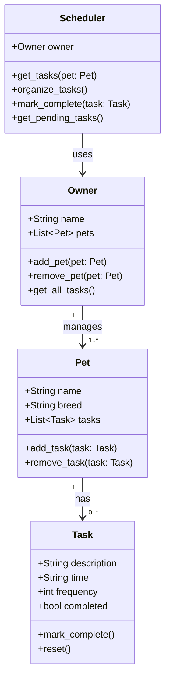

```mermaid
classDiagram

class Task {
    +String description
    +String time
    +int frequency
    +bool completed
    +mark_complete()
    +reset()
}

class Pet {
    +String name
    +String breed
    +List~Task~ tasks
    +add_task(task: Task)
    +remove_task(task: Task)
}

class Owner {
    +String name
    +List~Pet~ pets
    +add_pet(pet: Pet)
    +remove_pet(pet: Pet)
    +get_all_tasks()
}

class Scheduler {
    +Owner owner
    +get_tasks(pet: Pet)
    +organize_tasks()
    +mark_complete(task: Task)
    +get_pending_tasks()
}

Owner "1" --> "1..*" Pet : manages
Pet "1" --> "0..*" Task : has
Scheduler --> Owner : uses
```
