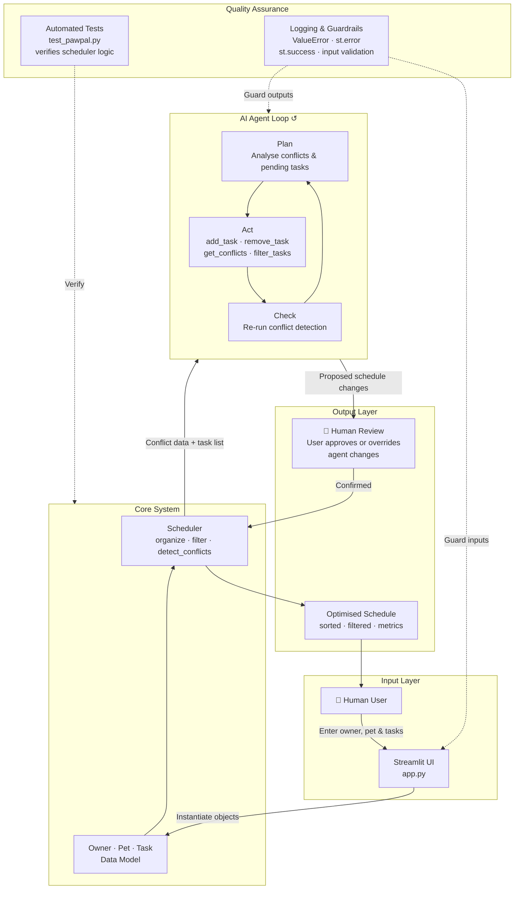

```mermaid
flowchart TD
    subgraph INPUT["Input Layer"]
        User["👤 Human User"]
        UI["Streamlit UI\napp.py"]
    end

    subgraph CORE["Core System"]
        DM["Owner · Pet · Task\nData Model"]
        SCH["Scheduler\norganize · filter · detect_conflicts"]
    end

    subgraph AGENT["AI Agent Loop  ↺"]
        direction TB
        A1["Plan\nAnalyse conflicts & pending tasks"]
        A2["Act\nadd_task · remove_task\nget_conflicts · filter_tasks"]
        A3["Check\nRe-run conflict detection"]
        A1 --> A2 --> A3 --> A1
    end

    subgraph OUTPUT["Output Layer"]
        SCHED["Optimised Schedule\nsorted · filtered · metrics"]
        REVIEW["👤 Human Review\nUser approves or overrides\nagent changes"]
    end

    subgraph QA["Quality Assurance"]
        TEST["Automated Tests\ntest_pawpal.py\nverifies scheduler logic"]
        LOG["Logging & Guardrails\nValueError · st.error\nst.success · input validation"]
    end

    User -->|"Enter owner, pet & tasks"| UI
    UI -->|"Instantiate objects"| DM
    DM --> SCH
    SCH -->|"Conflict data + task list"| AGENT
    AGENT -->|"Proposed schedule changes"| REVIEW
    REVIEW -->|"Confirmed"| SCH
    SCH --> SCHED
    SCHED --> User

    TEST -.->|"Verify"| CORE
    LOG -.->|"Guard inputs"| UI
    LOG -.->|"Guard outputs"| AGENT
```
